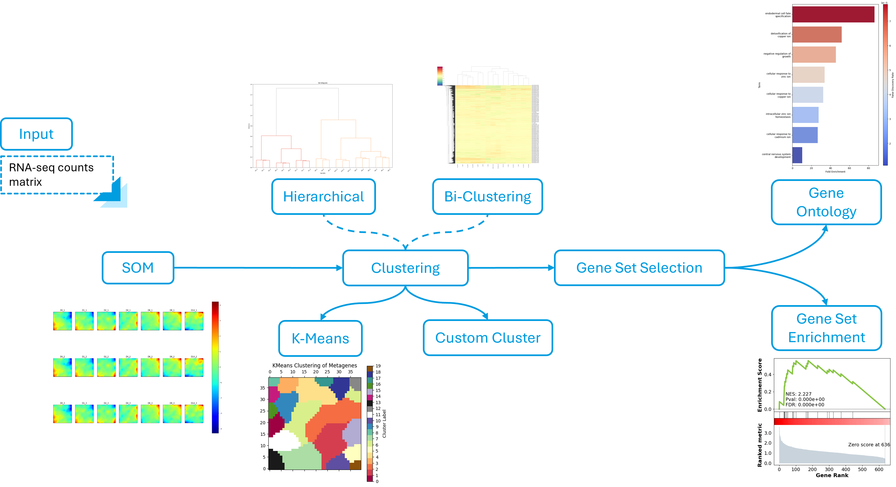
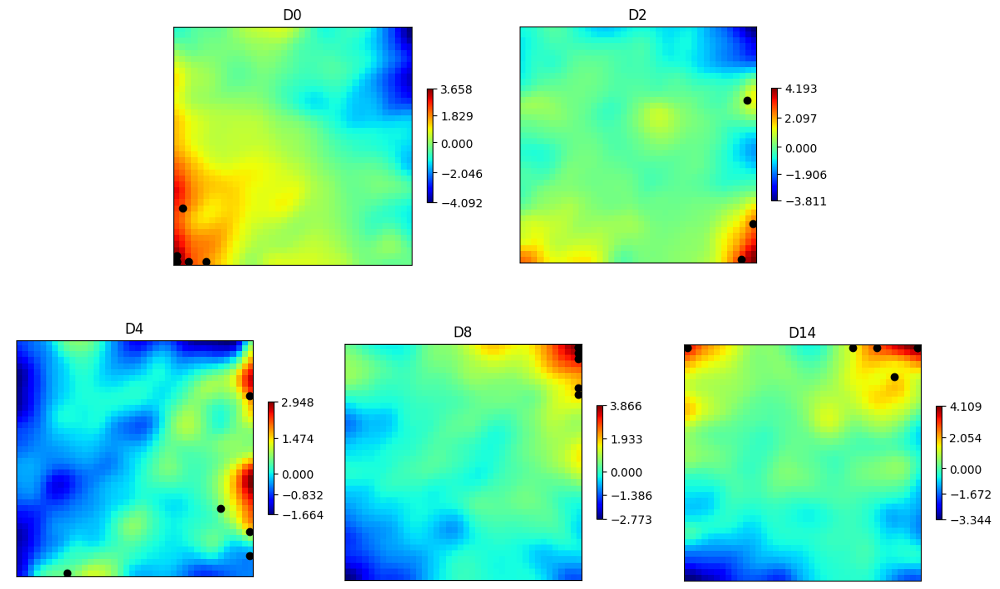
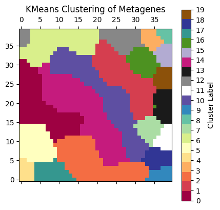

# Workflow for analysis of transcriptomic data from stem cell differentiation, using Machine Learning

This is a Python workflow for exploring RNA-seq data with unsupervised machine learning. It uses a Self-Organising Map (SOM) to project high-dimensional gene-expression profiles onto a two-dimensional grid, placing genes with similar expression patterns into nearby metagenes.

The resulting map can be visualised, partitioned into clusters, and interpreted using Gene Ontology (GO) and Gene Set Enrichment Analysis (GSEA). The workflow was developed for my master's thesis in Biomedical Engineering at Instituto Superior Técnico.

## Main features

- SOM training with PCA weight initialisation
- Gene-to-metagene mapping
- Correlation, variance and entropy maps for SOM evaluation
- Expression heatmaps for individual samples and averaged replicates
- K-Means, evidence-accumulation K-Means and hierarchical clustering
- Cluster evaluation with silhouette, Calinski-Harabasz and Davies-Bouldin scores
- Interactive drawing of custom clusters on the SOM grid
- Gene Ontology and Gene Set Enrichment analysis of selected gene groups

## Workflow

```text
RNA-seq count matrix
        |
        v
Filtering and normalisation (previously performed separately)
        |
        v
SOM training and gene mapping
        |
        v
Expression and quality maps
        |
        v
Automatic or user-defined clustering
        |
        v
GO and GSEA interpretation
```




The input is an RNA-seq expression matrix with genes as rows and samples as columns. In the thesis case studies, preprocessing included low-count filtering, TMM normalisation, conversion to counts per million, log2 transformation and mean centring. This pre-processing step is not included in the workflow-

The code is divided into four main modules:

- **`SOM`** - trains, saves and loads maps; averages replicates; maps gene symbols and Ensembl IDs to SOM nodes.
- **`mapping`** - produces quality maps and expression portraits across samples or experimental stages.
- **`clustering`** - applies and evaluates clustering methods and supports interactive custom-cluster selection.
- **`gogsea`** - performs GO analysis, creates ranked gene lists and runs GSEA against public or user-provided gene sets.

## Installation

Clone the repository and install the dependencies:

```bash
python -m pip install -r requirements.txt
```

The analysis functions can then be imported from the corresponding source modules. Consult their current signatures for the required dataframes, arrays, map parameters and resource paths.

There is also a notebook which serves as template for the full workflow (OmicsClust Template). The adapted template was used for an edge case during the time of writing the thesis and stands only as an additional resource. 

## Case study results

The workflow was tested on RNA-seq data from a 14-day differentiation of human embryonic stem cells into cardiomyocytes. A **40 x 40 SOM**, trained for **180 epochs**, organised the genes into metagenes that reflected the progression from pluripotency to immature cardiomyocytes.

Key findings:

- Expression maps captured a clear shift between successive differentiation stages, with stage markers generally located in the expected highly expressed regions.
- Correlation, variance, entropy and silhouette scores helped distinguish reliable clusters from low-information regions of the map.
- GO analysis associated pluripotent-cell clusters with ribosome biogenesis, DNA replication and mitosis, while cardiomyocyte clusters were linked to cardiac morphogenesis and contraction.
- GSEA identified enrichment for myogenesis and cardiomyocyte development in mature-stage clusters, and OCT4-related processes in pluripotent-stage clusters.

These results were consistent with the known biology and with previous analysis of the dataset, showing that the workflow could generate interpretable results from RNA-seq data.








## Conclusions

The project combines SOM visualisation, clustering and enrichment analysis in a single workflow for RNA-seq exploration. Across the thesis case studies, it reproduced differentiation patterns consistent with previous findings and could be applied to different cell types and experimental protocols.

The user-drawn cluster was the main addition to existing SOM-based workflows, allowing researchers to investigate specific regions without being restricted to an automatic partition. Future improvements include usability testing, reducing external dependencies, expanding SOM configuration options, using PCA for sample outlier detection and improving visualisation of relationships between enriched pathways.

## Acknowledgements

This work was performed from November 2023 to October 2024 at the Stem Cell Engineering Research Group of the Institute for Bioengineering and Biosciences (iBB-SCERG) and Instituto de Telecomunicações (IT), Lisbon, Portugal.

The project was supervised by Professors **Carlos André Vitorino Rodrigues** and **Ana Luísa Nobre Fred**, with the collaboration and support of **Sofia de Pinto e Lobo da Silva Agostinho**.

## Author

**Afonso Reis**  
MSc in Biomedical Engineering, Instituto Superior Técnico
